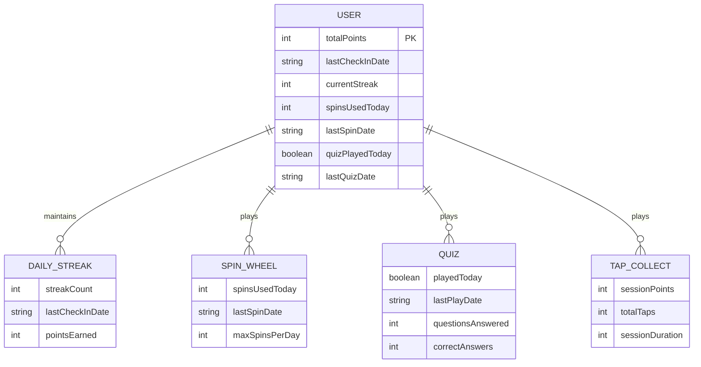
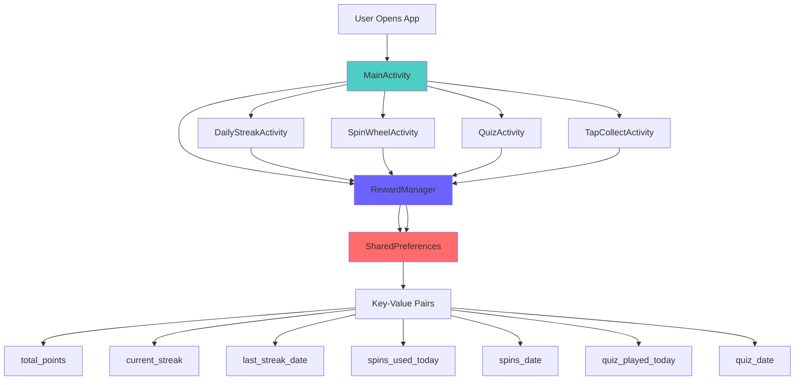
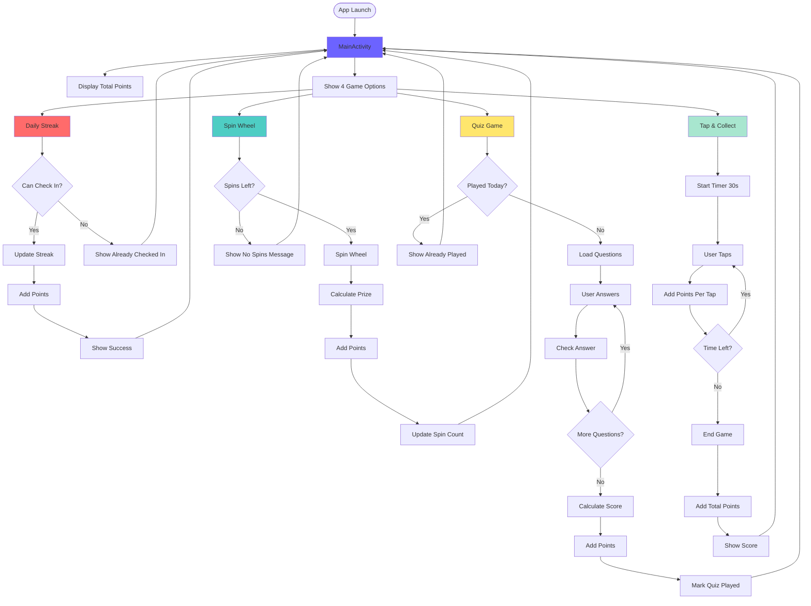
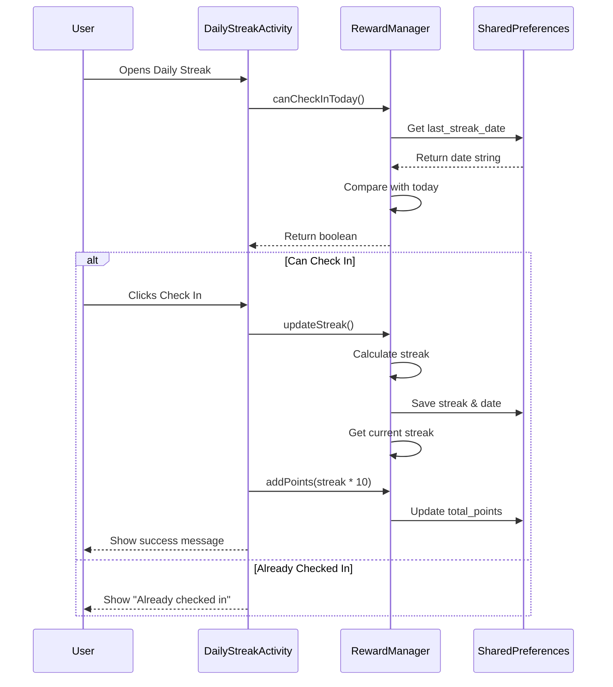
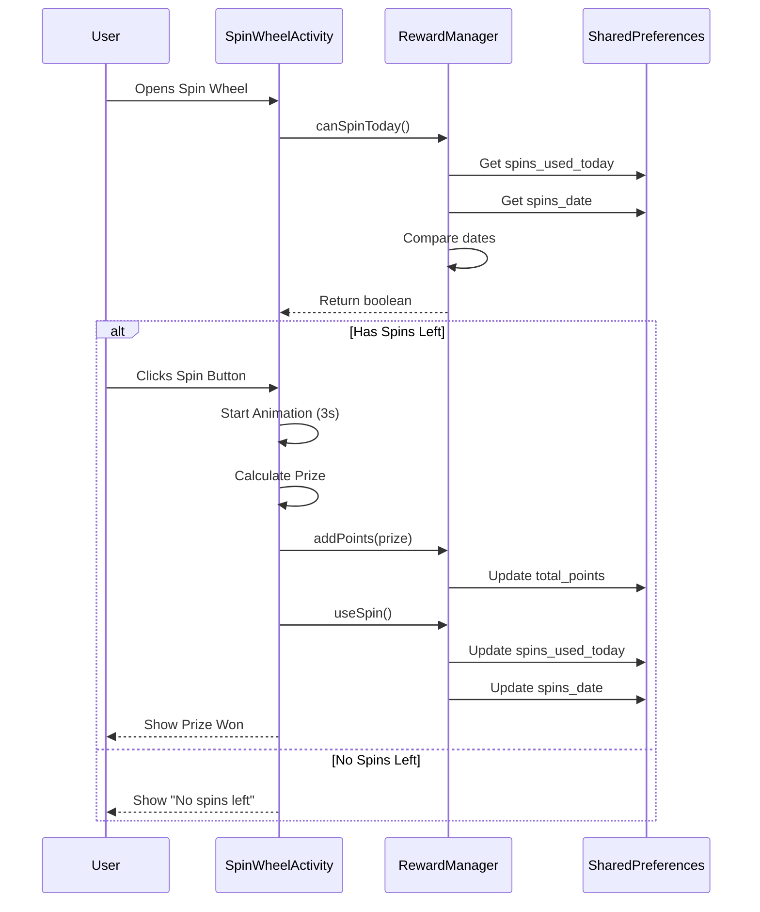
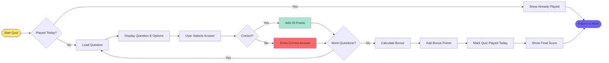
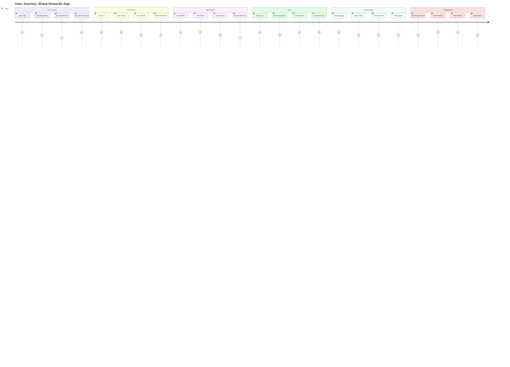

# Architecture Documentation - Sharp Rewards App

## Table of Contents
1. [System Architecture](#system-architecture)
2. [Entity Relationship Diagram (ERD)](#entity-relationship-diagram-erd)
3. [Data Relationship Diagram (DRD)](#data-relationship-diagram-drd)
4. [User Journey / Flow Diagrams](#user-journey--flow-diagrams)

---

## System Architecture

### Overview
Sharp Rewards App is a native Android application built with Java, using local data storage through SharedPreferences. The app follows a simple Activity-based architecture with a centralized RewardManager for data management.

### Architecture Pattern
- **Pattern**: Single Activity Pattern (with multiple Activities for navigation)
- **Data Storage**: SharedPreferences (Key-Value storage)
- **UI Framework**: Android XML Layouts with Material Design
- **State Management**: SharedPreferences-based persistence

### Components
1. **Activities**: UI components for each screen
2. **RewardManager**: Centralized data management class
3. **SharedPreferences**: Local data persistence layer

---

## Entity Relationship Diagram (ERD)

### Data Model Overview
Since the app uses SharedPreferences (key-value storage) rather than a relational database, the data model is simplified but can be represented as entities:



### Text-Based ERD (Alternative)

```
┌─────────────────────────────────────────────────────────────┐
│                         USER                                │
├─────────────────────────────────────────────────────────────┤
│ PK  totalPoints: int                                        │
│     lastCheckInDate: string                                 │
│     currentStreak: int                                      │
│     spinsUsedToday: int                                     │
│     lastSpinDate: string                                    │
│     quizPlayedToday: boolean                                │
│     lastQuizDate: string                                    │
└─────────────────────────────────────────────────────────────┘
         │                    │                    │
         │                    │                    │
    ┌────▼────┐          ┌───▼────┐          ┌────▼─────┐
    │  DAILY  │          │ SPIN   │          │   QUIZ   │
    │ STREAK  │          │ WHEEL  │          │          │
    ├─────────┤          ├────────┤          ├──────────┤
    │ streak  │          │ spins  │          │ played   │
    │ count   │          │ used   │          │ today    │
    │ last    │          │ last   │          │ last     │
    │ date    │          │ date   │          │ date     │
    └─────────┘          └────────┘          └──────────┘
                                │
                                │
                         ┌──────▼───────┐
                         │ TAP COLLECT  │
                         ├──────────────┤
                         │ session      │
                         │ points       │
                         │ total taps   │
                         └──────────────┘
```

---

## Data Relationship Diagram (DRD)

### Data Flow and Relationships



### Data Structure Details

#### SharedPreferences Keys and Values

```
SHAREPREFERENCES: "SharpRewardsPrefs"
├── KEY_TOTAL_POINTS: int
│   └── Stores cumulative points earned
│
├── KEY_CURRENT_STREAK: int
│   └── Stores consecutive daily check-ins
│
├── KEY_LAST_STREAK_DATE: string
│   └── Format: "YYYY-M-D" (e.g., "2024-1-12")
│
├── KEY_SPINS_USED_TODAY: int
│   └── Tracks spins used in current day
│
├── KEY_SPINS_DATE: string
│   └── Last date spins were used
│
├── KEY_QUIZ_PLAYED_TODAY: boolean
│   └── Whether quiz was played today
│
└── KEY_QUIZ_DATE: string
    └── Last date quiz was played
```

### Data Flow Diagram

```
┌──────────────┐
│   Activities │
│  (UI Layer)  │
└──────┬───────┘
       │
       │ Read/Write
       │
┌──────▼───────────────┐
│   RewardManager      │
│  (Business Logic)    │
│                      │
│  - getTotalPoints()  │
│  - addPoints()       │
│  - updateStreak()    │
│  - canSpinToday()    │
│  - canPlayQuizToday()│
└──────┬───────────────┘
       │
       │ Store/Retrieve
       │
┌──────▼───────────────┐
│  SharedPreferences   │
│   (Data Layer)       │
│                      │
│  Key-Value Storage   │
└──────────────────────┘
```

---

## User Journey / Flow Diagrams

### Main User Flow



### Daily Streak Flow (Detailed)



### Spin Wheel Flow (Detailed)



### Quiz Game Flow (Detailed)



### Complete User Journey Map



### Navigation Flow Diagram

```
┌─────────────────────────────────────────────────────────────┐
│                    APPLICATION LAUNCH                        │
└──────────────────────┬──────────────────────────────────────┘
                       │
                       ▼
              ┌─────────────────┐
              │  MainActivity   │
              │  (Home Screen)  │
              │                 │
              │  • Total Points │
              │  • Game Cards   │
              └────────┬────────┘
                       │
        ┌──────────────┼──────────────┬──────────────┐
        │              │              │              │
        ▼              ▼              ▼              ▼
┌─────────────┐ ┌───────────┐ ┌───────────┐ ┌─────────────┐
│   Daily     │ │   Spin    │ │   Quiz    │ │     Tap     │
│   Streak    │ │   Wheel   │ │   Game    │ │   Collect   │
│             │ │           │ │           │ │             │
│ • Check In  │ │ • Spin    │ │ • 10 Q's  │ │ • 30 sec    │
│ • View      │ │ • Win     │ │ • Points  │ │ • Tap Fast  │
│   Streak    │ │ • 5/day   │ │ • 1/day   │ │ • Unlimited │
└──────┬──────┘ └─────┬─────┘ └─────┬─────┘ └──────┬──────┘
       │              │              │              │
       └──────────────┴──────────────┴──────────────┘
                       │
                       ▼
              ┌─────────────────┐
              │  RewardManager  │
              │  Updates Data   │
              └─────────────────┘
                       │
                       ▼
              ┌─────────────────┐
              │ SharedPreferences│
              │   Save State    │
              └─────────────────┘
                       │
                       ▼
              ┌─────────────────┐
              │  Return to Main │
              │   (Updated)     │
              └─────────────────┘
```

---

## Summary

### Data Storage Architecture
- **Storage Type**: SharedPreferences (Key-Value pairs)
- **Data Persistence**: Local device storage
- **No Database**: Simple key-value storage is sufficient
- **No API**: Fully offline functionality

### User Flow Characteristics
1. **Entry Point**: MainActivity displays all game options
2. **Navigation**: Simple Activity-based navigation
3. **State Management**: Centralized through RewardManager
4. **Data Flow**: Activities → RewardManager → SharedPreferences

### Key Design Decisions
1. **SharedPreferences over Database**: Simple data model doesn't require SQLite
2. **Centralized RewardManager**: Single source of truth for data operations
3. **Daily Limitations**: Implemented for FOMO mechanics
4. **Point System**: Cumulative points tracked across all games

---

## Diagram Legend

### ERD Symbols
- `PK`: Primary Key
- `||--o{`: One-to-Many relationship
- Entities represent logical data groupings

### Flow Diagram Symbols
- Rectangles: Processes/Actions
- Diamonds: Decision points
- Rounded rectangles: Start/End points
- Arrows: Flow direction

---

*Note: This documentation uses Mermaid diagrams which are natively supported by GitHub. The diagrams will render automatically when viewed on GitHub.*
